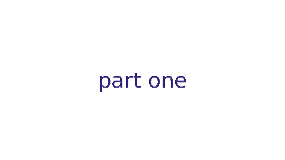

# Import Labels and Timings in Synfig (Open Source 2D Animation Studio)
##  - aka generate Keyframes and Kinetic Typography (artistic subtitles)

A [Synfig](http://synfig.org) plug-in to create time reference and/or artistic kinetic text effects in Synfig, from [Audacity](http://audacity.sourceforge.net/) track labels (aka subtitles) or excel/openoffice data.

Synfig Studio is a free and open-source 2D animation software, designed as powerful industrial-strength solution for creating film-quality animation using a vector and bitmap artwork.

The generated time reference (keyframes) is great for synchronizing animation with your audio.

The generated kinetic texts objects is a great basis for beautiful typographic animations, and can be customized easily to achieve your prefered effect(s).

## Result

Different effects are readily available, and it is (rather) easy to create new ones. Check out [our gallery](https://github.com/berteh/synfig-import-labels/wiki/Gallery) for many examples, a typical one is descending text:



A **demo animation** illustrating many more effects at once is online at https://www.youtube.com/watch?v=F4pDivKQf-g

Using a simple white background and importing a set of 6 text lines with their timings the following is generated automatically: automatic keyframes (top-right), automatic objects (bottom-right) auto-animated (bottom-left), and ready to be fine-tuned in Synfig before exporting for the world to see ;)


## Use

Run the script from within synfig:   

1. open your synfig project
1. run the plugin at _> Plug-Ins > Import Labels and Timings_

or from the command-line:

	python synfig-import-labels.py in.sifz (labels.txt (out.sifz))

To create your own timed labels file you can:

1. use [Audacity to label track segments](http://multimedia.journalism.berkeley.edu/tutorials/audacity/adding-labels/)
1. export your labels via Tracks > Edit Labels > export, in Audacity.

or simply use Notepad and create a table with 3 "columns": _start time (in sec)_ ``tab`` _end time (in sec)_``tab`` _text (single line)_.
You can add, optionally, add a 4th column with the name of ``template`` to use for this text line and the following ones. Save the file as _labels.txt_ in the directory of your sifz Synfig file project. Titles in the first row are optional, just the data will do just fine, but if you use titles, they must be _exactly_ the following:

    start	stop	text	template
    0.500	1.50	first sentence showing for 1 second 	descending-text
    1.50	1.90	cool !
    2.40	3.2784	your imagination is the limit ! 	revealing-text


You can use any spreadsheet software that is able to export to tsv (_tab separated value_ file), such as OpenOffice or Excel, just make sure to save as UTF-8 if you need proper accents supports.

Not mentioning any ``template`` column will simply use the default template (see [Configuration](#configuration))

## Video Tutorial

The use of this plugin to generate keyframes in a complete animation design is described in the [Synfig Audio Synchronisation tutorial](http://wiki.synfig.org/wiki/Doc:Audio_Synchronisation)

A tutorial will be written on creating kynetic typographies one day... but I (not secretly) hope you beat me to it!

## Install

Decompress [plugin archive](https://github.com/berteh/synfig-import-labels/archive/master.zip ) into your synfig plugins directory (in linux: home/-user-/.synfig/plugins)

Another option is to clone [this repository](https://github.com/berteh/synfig-import-labels.git) in the same location.

Requirements: Python (Synfig is a recommended option) - more info on [Synfig Plugins page](http://wiki.synfig.org/wiki/Doc:Plugins#How_to_install_plugins)

## Configuration

edit `settings.py` for customisation:

```python
# configuration for keyframes import
#
LABELS_FILE = "labels.txt" 	# audacity labels file name, must be located in your synfig project directory
IMPORT_START = True         # set to True to import keyframe for start of label
IMPORT_END = False          # set to True to import keyframe for end of label
START_SUFFIX = ""           # suffix to add to a label-start keyframe, to distinguish it from label-end frame
END_SUFFIX = " - end"       # suffix to add to a label-end keyframe, to distinguish it from label-start frame
OVERWRITE_KEYFRAMES_WITH_SAME_NAME = False   # set to True to replace keyframe with exact same description
GENERATE_OBJECTS = True     # set to True to generate objects (such as text layers) for each label
#
# settings below only matter to object generation. don't bother if GENERATE_OBJECTS is False.
TEMPLATE_NAME = "appearing-text"  # the name of template you want to use. must be located in templates/ subdirectory, with .xml extension. default is "popping-text"
SPLIT_WORDS = False			# split each word in a separate object
WAYPOINT_TYPE = "halt"      # one of: constant, auto, linear, clamped, halt
RANDOM_ORIGIN = 70          # set to a percentage [0-100] to randomize the object origin in the whole document viewbox (0 will stack them all at [0,0])
ANIMATION_INTERVAL = 0.5    # interval (before and after the label time) used for (in & out) transition, in seconds. default is 0.5
#
```

## Contribution

Got other ideas or templates? add them to the [wiki](/wiki/Gallery) or [create a pull request](https://help.github.com/articles/using-pull-requests/) to share them!


## Support
Preferably use github's [issues tracker](https://github.com/berteh/synfig-import-labels/issues) for bug reports, feature requests and contributing to this code.

## Changelog

- v0.1 - August 2014 - keyframe generation
- v0.2 - September 2015 - objects generation
- v0.3 - June 2016 - tiny improvements

## Licence
GNU-GPL v2, same as [Synfig Studio](http://synfig.org).

This package is free software; you can redistribute it and/or modify it under the terms of the GNU General Public License as published by the Free Software Foundation; either version 2 of the License, or (at your option) any later version.

This package is distributed in the hope that it will be useful, but WITHOUT ANY WARRANTY; without even the implied warranty of MERCHANTABILITY or FITNESS FOR A PARTICULAR PURPOSE.  See the GNU General Public License for more details.

You should have received a copy of the GNU General Public License along with this program; if not, write to the Free Software Foundation, Inc., 51 Franklin St, Fifth Floor, Boston, MA  02110-1301 USA or visit http://www.gnu.org/licenses/gpl.html